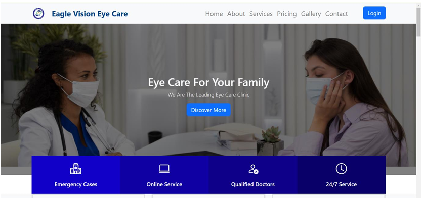
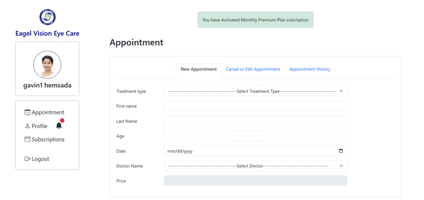
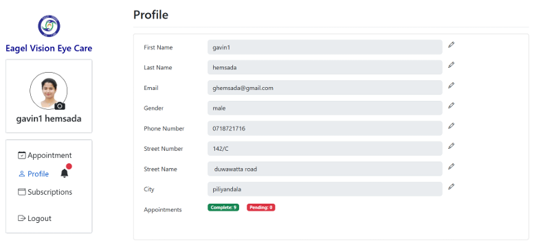
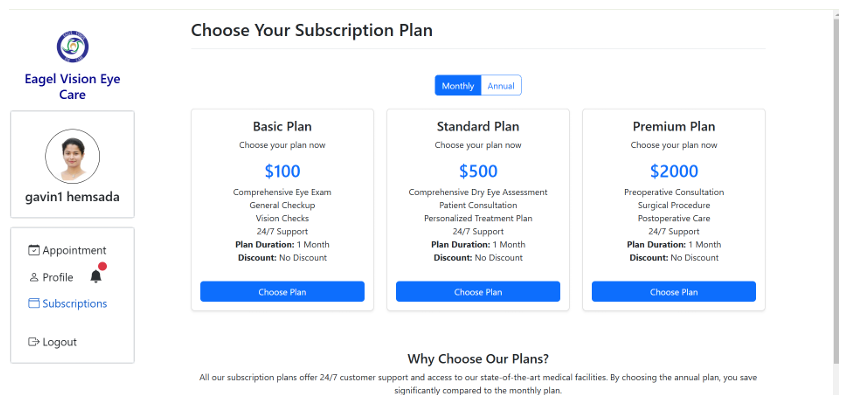
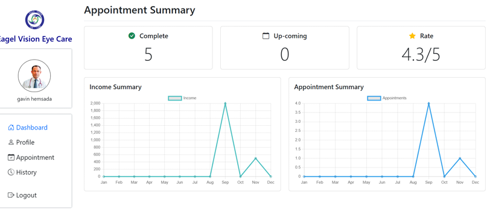
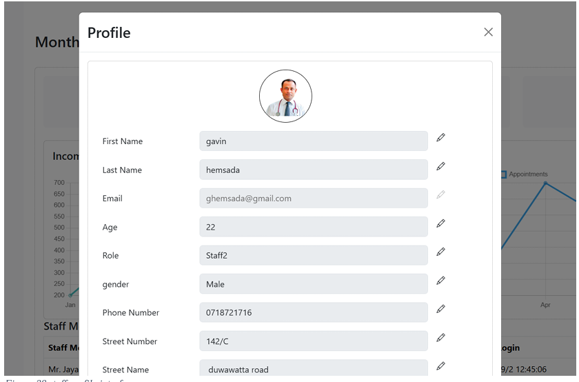
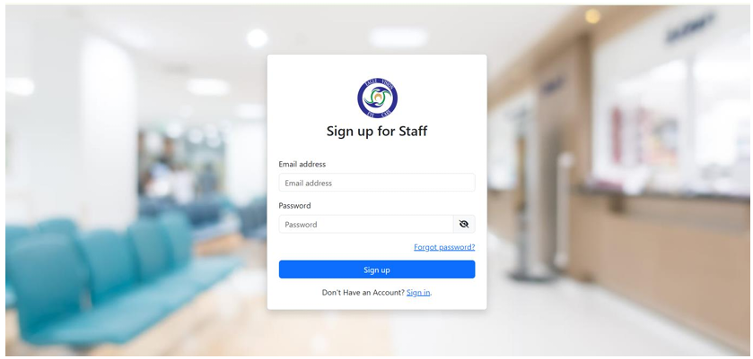
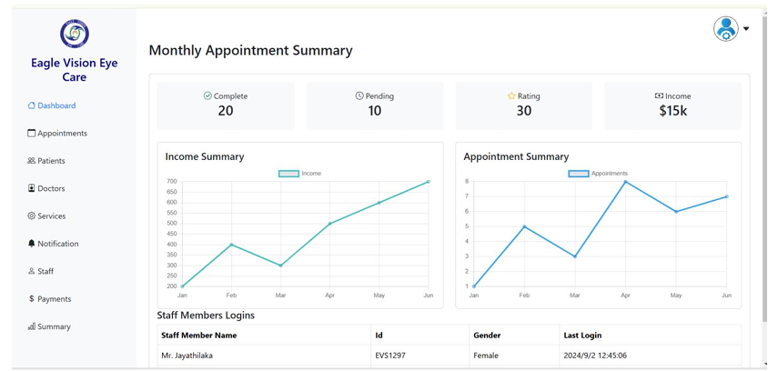
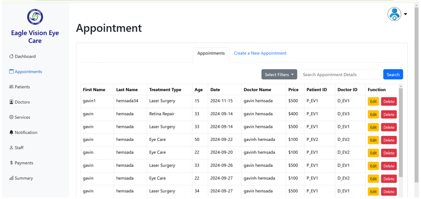

# Eye Clinic Management System

## Project Overview
The Eye Clinic Management System is a comprehensive web-based application designed to streamline and enhance the operations of an eye clinic. This system provides an efficient way to manage patient records, appointments, billing, and communication among stakeholders. The project includes both frontend and backend development to ensure a seamless user experience.

### Project Stakeholders:
1. **Patients**: Book appointments, receive notifications, and make payments online.
2. **Doctors**: Manage appointments, view patient records, and provide consultations.
3. **Staff**: Handle administrative tasks such as scheduling and record management.
4. **Admin**: Oversee the entire system, manage users, and generate reports.

---

## Features

### General Features:
- User-friendly interface using **HTML**, **Bootstrap 5**, and **JavaScript**.
- Secure backend built with **PHP**.
- Payment gateway integration using **PayPal**.
- Email notifications via **SMTP**.

### Patient Features:
- Account registration and login.
- Online appointment booking.
- Payment processing for services.
- Email reminders for appointments.

### Doctor Features:
- View and manage scheduled appointments.
- Access patient medical records.
- Add consultation notes.

### Staff Features:
- Schedule and reschedule appointments.
- Manage patient records and doctor schedules.
- Support administrative operations.

### Admin Features:
- Manage users (patients, doctors, staff).
- Generate clinic performance and financial reports.
- Oversee all operations for quality assurance.

---

## Technology Stack

### Frontend:
- **HTML5**
- **Bootstrap 5**
- **JavaScript**

### Backend:
- **PHP**
- **MySQL** (for database management)

### Third-Party Integrations:
- **PayPal** (Payment Gateway)
- **SMTP** (Email Notifications)

---

## Setup Instructions

### Prerequisites:
- A web server (e.g., Apache or Nginx).
- PHP 7.4 or higher.
- MySQL database.
- Composer (for managing PHP dependencies).

### Installation Steps:
1. Clone the repository:
   ```bash
   git clone <repository-url>
   ```
2. Navigate to the project directory:
   ```bash
   cd eye-clinic-management-system
   ```
3. Set up the database:
   - Create a MySQL database.
   - Import the `eagel_eye_care.sql` file located in the `db` folder.

4. Start the server:
   - Using XAMPP/WAMP, place the project folder in the `htdocs` directory.
   - Start Apache and MySQL services.

5. Access the application:
   - Open your web browser and navigate to `http://localhost/eye clinic management system` and `http://localhost/eye-clinic-management-system/admin`.

---

## Group Members
1. **[@AbeywardhanaHRK](https://github.com/AbeywardhanaHRK)** - Role: Frontend Development
2. **[@dhanuddharajayaruwan](https://github.com/dhanuddharajayaruwan)** - Role: Frontend Development
3. **[@GavinHemsada](https://github.com/GavinHemsada)** - Role: Developed the back-end functionality, database integration, Managed payment gateway and email gateway integrations

---

## Contribution Workflow
1. Fork the repository.
2. Create a new branch for your feature or bug fix:
   ```bash
   git checkout -b feature-name
   ```
3. Commit your changes with a clear message:
   ```bash
   git commit -m "Add feature description"
   ```
4. Push the branch to the repository:
   ```bash
   git push origin feature-name
   ```
5. Open a pull request for review.

---

## Future Enhancements
- Integration of telemedicine consultations.
- Advanced analytics and reporting.
- Multilingual support for broader accessibility.

---

## License
This project is for educational purposes only and is not intended for commercial use.

---

## Acknowledgments
We extend our gratitude to our university and faculty for their guidance and support throughout this project.

## License
This project is licensed under the Apache License 2.0 License - see the [LICENSE](./LICENSE) file for details.

## Screenshots

### Homepage


### Appointment Booking


### Patient Dashboard


### Patient Login


### Payemnt


### Doctor Dashboard


### Staff Profile


### Admin Login


### Admin Dashboard


### Admin Appointment Dashboard


